* 版本控制在實驗科學的功用已經越來越重要。如果比喻可重製研究是一種創作概念，版本控制是實現概念的實作程序，有了版本控制系統維護的專案，等於為專案內的檔案留下重要時刻的生命紀錄。使用版本控制系統維護的可重製研究成果，讀者可以檢視紀錄驗證每一份檔案的成長過程，可說是經驗主義知識論的最高境界。  
  
* 越來越多程式設計者與開源運動人士( Open Source )接受Git，除了管理專案內容的成長紀錄，分散式架構是使其廣為歡迎的關鍵，同時也是無程式設計知識的人士上手的重要關卡。  
  
* 本章說明Git的安裝及設定、github的註冊以及RSA key的設定。後續R專案的進階管理以實況情境介紹Git指令的使用方法，以及透過github與他人協同合作。本章與後續章節都是幫助未有使用Git與github經驗的讀者，有一個學習的開始，內容是筆者從[Pro Git](https://git-scm.com/book/en/v2)與[30 天精通 Git 版本控管](https://github.com/doggy8088/Learn-Git-in-30-days)兩本電子書，以及個人使用經驗濃縮而成。
  
* 讀者如果對於獨自學習沒有信心，可以找尋有經驗的使用者協助，常用Git的使用者多數是樂於分享知識的開源人士，在個人時間與能力允許的情況下，都樂於幫助他人成長。

1. <a href='#1'>Git的安裝與設定</a>
    + <a href='#1A'>Git的使用哲學</a>
    + <a href='#1B'>下載與安裝Git</a>
    + <a href='#1C'>設定身份識別資訊</a>
2. <a href='#2'>使用Github</a>
    + <a href='#2A'>註冊Github帳號</a>
    + <a href='#2B'>設定RSA key</a>

###<a name='1'>版本控制系統與管理儲存檔案的作業系統是兩個獨立的系統</a>
* <a name='1A'>Git的使用哲學</a>  
    + 你從Windows的資料夾找出一份一小時前剛編輯完成的文件檔案，想檢查前一天你曾編輯的一段文字，但是重新打開才發現這段文字在最近一次的編輯被自已刪除了。如果前一晚你沒有在更改前另外存一份檔案，也沒有使用版本控制系統，你無法回溯這份文件的前晚版本的內容。若是有版本控制系統，每次有重大更新就留下版本紀錄，就能隨時查找每個版本之間的差異。  
    + 以上的例子說明管理檔案的作業系統與版本控制系統彼此獨立，作業系統儲存有最新內容的檔案實體，版本控制系統儲存檔案的版本更新紀錄。**兩種系統使用不同的指令與操作邏輯是很自然的事**。  
    + Git出現之前已經有其它版本控制系統問世，但是這幾年才開始接觸版本控制的使用者並不熟悉。好比Windows流行之前，Dos曾稱霸個人電腦市場將近十年，但是現在的電腦新手已經無法體認這段歷史。Git的開始源於2005年的Linux發展轉機，在此之前維護Linux核心的社群，是使用BitKeeper這套商用分散式版本控制系統，進行Linux核心的更新與開發，2005年社群與該家公司決裂，促使Linux之父Linus Torvalds開發Git，讓社群人士利用平行分支的特點，在不同機器維護同一套專案內容。  
    + 了解版本控制系統的運作概念與Git的發展簡史，筆者借用Pro Git裡的一張圖，說明安裝設定好Git之後，檔案在作業系統與在Git之中的狀態。圖中的*working directory*泛指任何作業系統裡，實體檔案所存在的目錄/資料夾。*git directory*是存在於Git系統裡的檔案版本紀錄，如果讀者有github帳號，會知道公開在github的專案一般稱為repository，兩者是同樣的意思。兩者之前有一塊*staging area*，這是讓使用者確認，是否要在Git系統建立檔案版本紀錄的緩衝區。因此安裝Git後，你的硬碟裡所有檔案都不會在Git建立紀錄。Git系統只針對你想建立紀錄的資料夾，經過兩個階段的指令(git add -> git commit)建立與更新紀錄。即使是同一份資料夾，也不是每次更新後，所有檔案都要在Git系統建立紀錄。  
      
  
* <a name='1B'>下載與安裝Git</a>
    + 進入[官方網站](https://git-scm.com/)，右方程式下載處會根據你所使用的作業系統，顯示對應的版本，點擊即開始下載。下載完成執行安裝程式，照步驟進行即可。筆者對於安裝路徑給予同樣的建議，安裝於非作業系統所在的分割區。筆者自已是安裝在`D:/Apps/Git`。
    + 除了Git主程式，github.com也開發給[windows](windows.github.com)與[Mac](mac.github.com)的圖形化介面應用程式。這套程式的安裝設定已達到全自動化的地步，與github連動的RSA key也包辦。為了讓讀者了解Git的設定邏輯，本章與後續章節筆者還是以Git主程式的設定與操作，做為主要內容。
    + Git主程式安裝完成後，桌面會出現這個圖示。點繋後會出現類似下圖的視窗，這就是`git bash`。  
    
    + `git bash`功能類似windows的`command line`，可以對實體檔案進行作業系統的管理動作，但是是利用linux指令，例如`ls`，`mv`等。Git系統的指令都由`git`開頭，安裝完成後，設定Git系統的指令就是一例。  
      
* <a name='1C'>設定身份識別資訊</a>
    + 類似一台電腦的WIndows可以給所有使用者通用設定，與給不同使用者的特定設定的設計，Git也有這兩種設定。特定使用者的設定是必要的，因為這是每次在Git系統建立版本紀錄，都會嵌入的訊息。
    + 建議讀者已註冊github帳號再來執行這一步，身份識別資訊有兩項：個人ID與e-mail，能用github的註冊ID與e-mail做為身份識別資訊，對新手來說是較合適的。
    + 確認要建立的身份識別資訊，在git bash輸入以下指令：  
    ```
    git config --global user.name "your_github_name"
    git config --global user.email "yours@email.com"
    ```
    + 建立之後可隨時執行以下指令，查詢已存在的設定檔內容，是否有你建立的身份識別資訊：  
    ```
    git config --global --list
    ```
  
###<a name='2'>Github是開源人士的社群平台</a>
* <a name='2A'>註冊Github帳號</a>
    + 與任何已知的社群平台一樣，初次造訪者從介面就了解要如何註冊。選好你要註冊的ID與e-mail，這也是個人Git系統的身份識別資訊。  
    
    + 第二步會詢問你要選擇何種類型使用者權限。免費使用者在github上建立的repository都是公開的，付費使用者才能依付費規模，設定一定數量的私有repository。付費使用者是有研發需要的公司或工作室，一般使用者選擇公開個人所有repository的免費使用權限。  
    
    + 完成後會見到如下圖的介面，可以開始建立遠端repository。如何建立請參考[從Github Repo自建R專案](Project.html#2B)。  
    
  
* <a name='2B'>設定RSA key</a>
    + 在github個人帳戶頁面，其中之一是設定RSA key。完成這項設定，任何要與github同步的應用程式或開發工具，都能直接在本機運用git bash或[github UI](windonws.github.com)，維護本機與github的內容。  
    + 以筆者的筆記型電腦為例，說明設定步驟。以windows為例，首先檢查個人資料夾裡`.ssh`的內容，同時打開`git bash`，切換到這個目錄。如下圖示範，筆者的筆記型電腦使用者名稱是`CSC`：  
    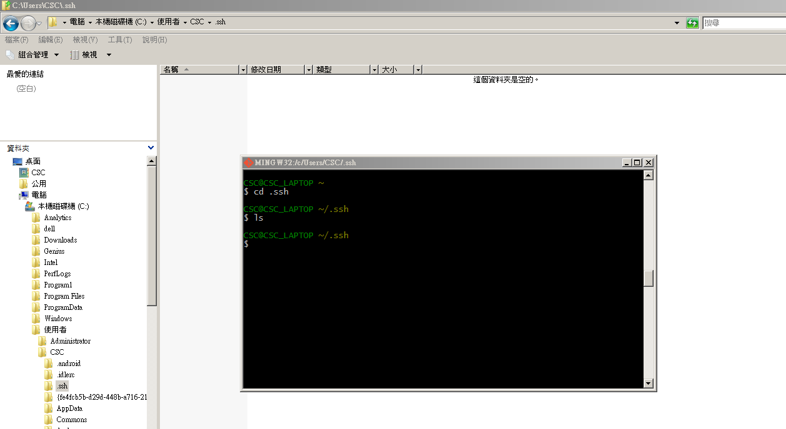  
    + 接著在`git bash`輸入第一個指令，開始設定RSA key，下圖是以筆者使用的e-mail為例，請讀者換成自已建立於Git系統的e-mail：  
    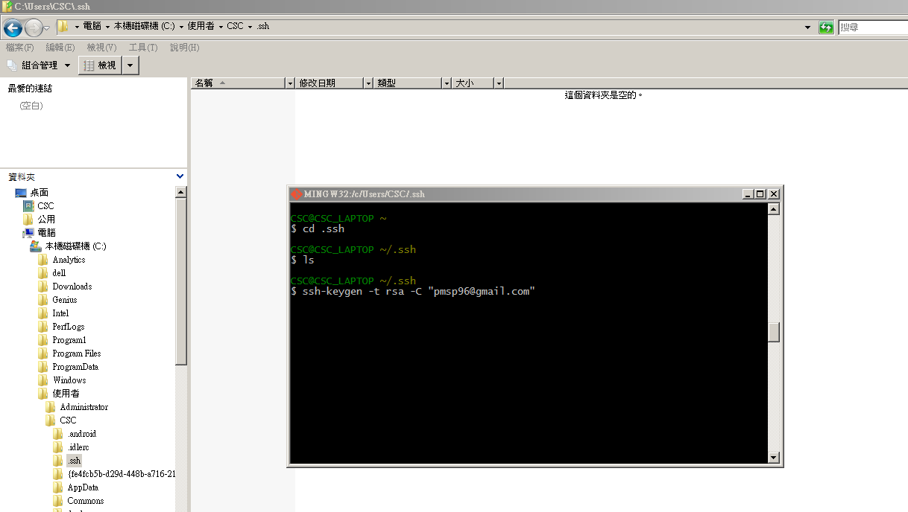  
    + 產生RSA key的過程中，詢問要存放的檔案名稱。預設是如下圖的`id_rsa`，有經驗的使用者如果有不只一個雲端資料庫，會在此步設定另一個檔案。若維持預設，按Enter即可：  
    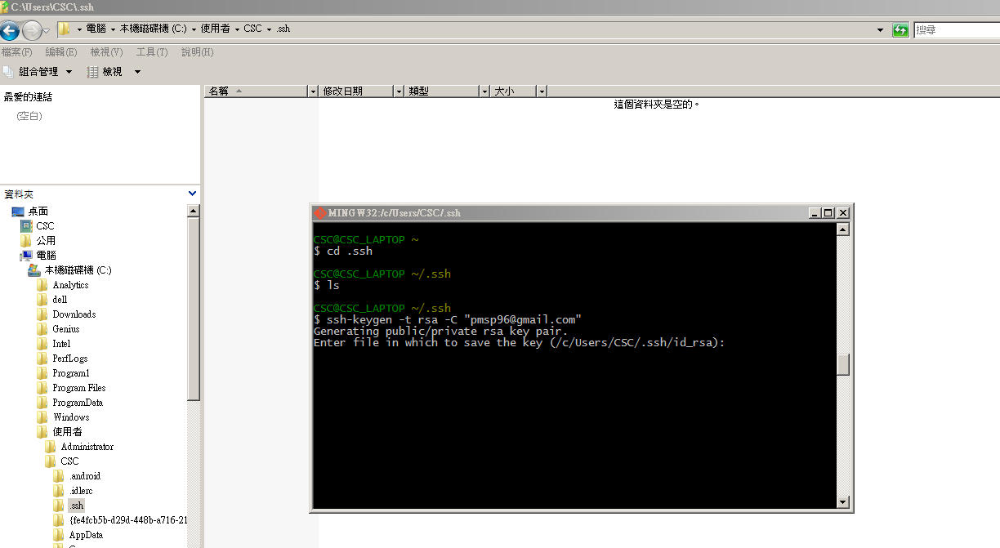  
    + 接著會詢問是否要為此RSA key設定一個密碼。如果讀者有資訊安全考量，可以設定，不然按兩次Enter跳過：  
    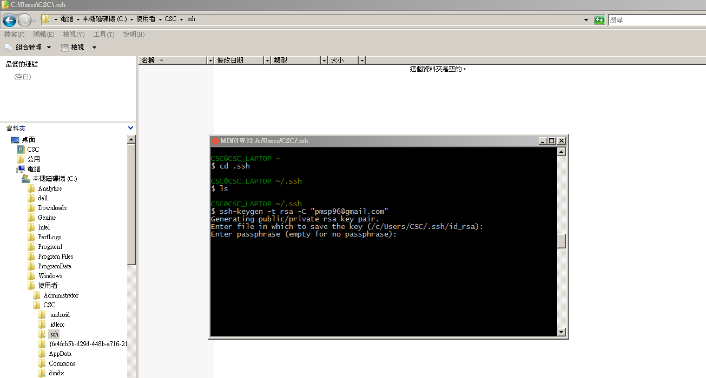  
    + 設定完密碼就會出現下圖的結果，`.ssh`資料夾也出現`id_rsa`和`id_rsa.pub`兩個檔案：  
    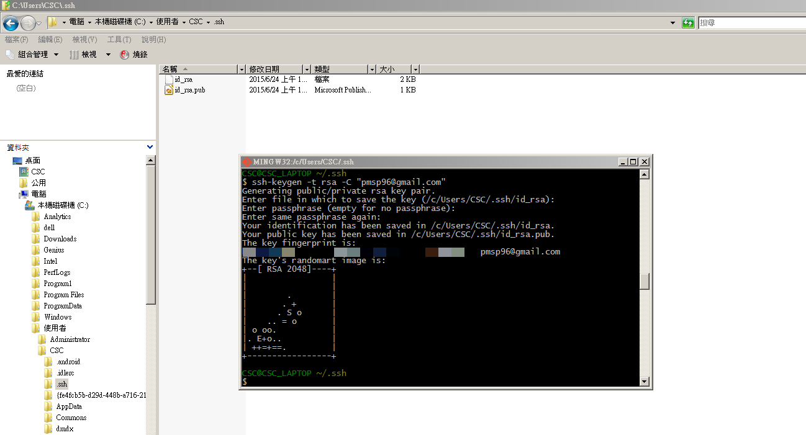  
    + 接著要開啟ssh功能，在`git bash`輸入下圖的指令：    
    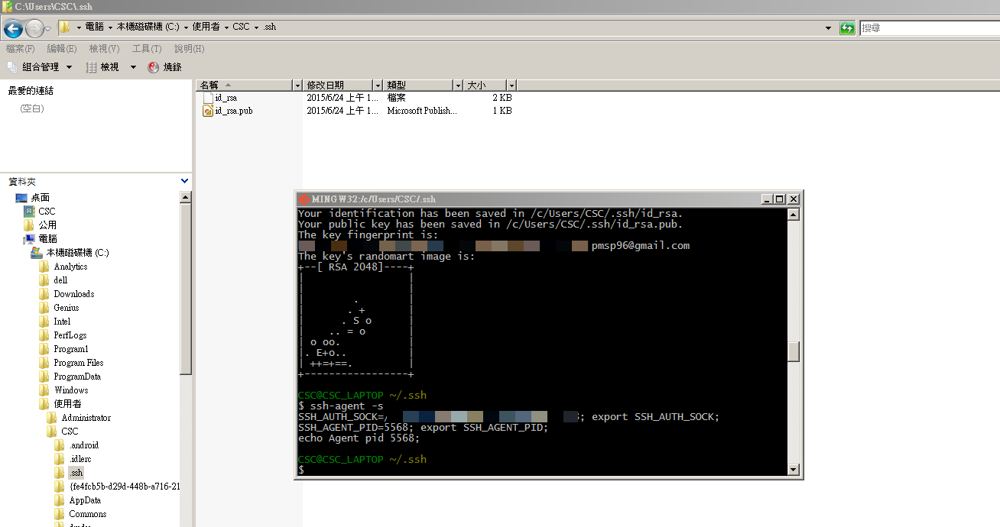  
    + 準備要切到github帳號設定頁面作業了。切過去前先複製`id_rsa.pub`的內容到系統剪貼薄，使用下圖示範的指令不用再另外開啟檔案複製內容：  
    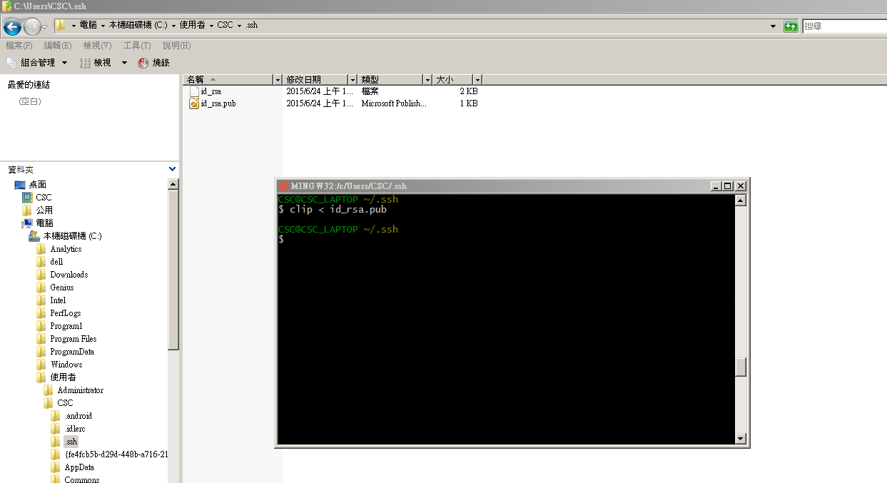  
    + 這是筆者的帳號設定頁面，目前只有設好研究室桌機的RSA key。  
    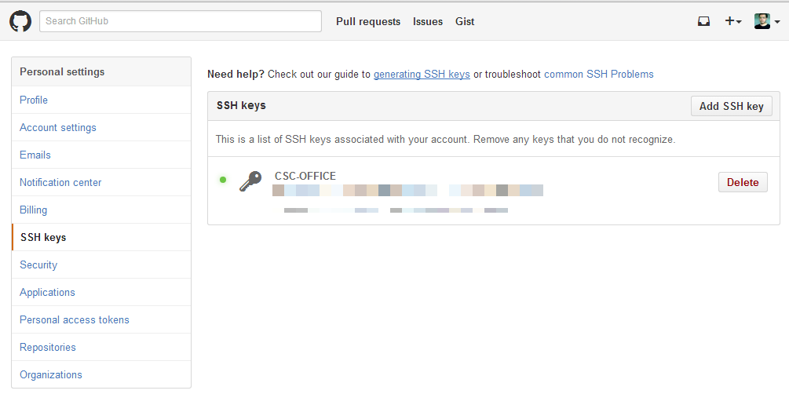  
    + 按一下下圖標示的`Add SSH key`，就會出現最下方的對話框。因為這是與筆者的筆電連動，所以Title取名`CSC-Laptop`。Key下方的馬賽克，將游標移到裡面，貼上複製到系統剪貼薄的`id_rsa.pub`內容。確認完成就按最下面的按鈕完成(未截到)。  
    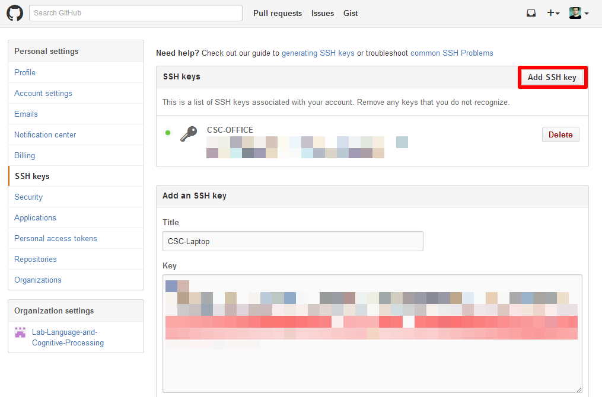  
    + 完成後多出一組key，可看到前方的圓點是灰色的，代表還未正式連動：    
    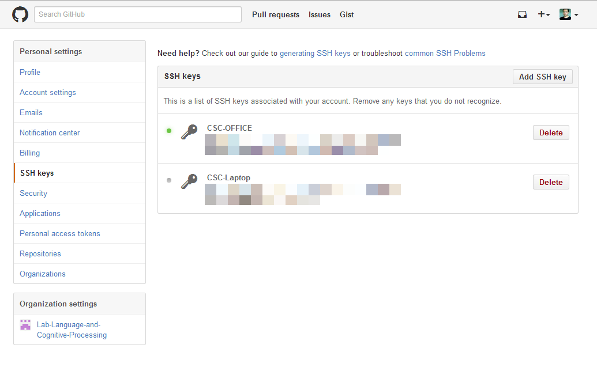  
    + 回到`git bash`，輸入下圖最後一行示範的指令：  
    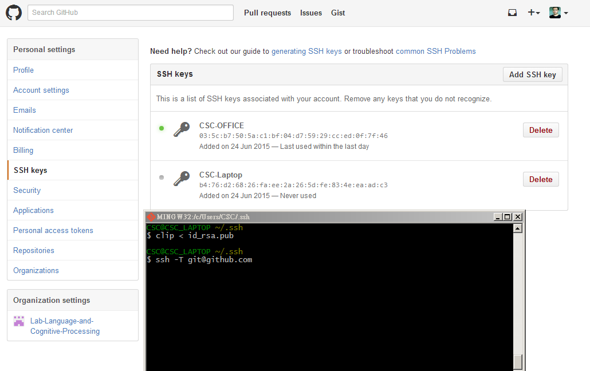  
    + 這個指令是要啟動存剛剛存在github的RSA key，到如下圖的訊息出現時，可以比對`git bash`印出的fingerprint和github上的內容是否一致。如果無誤請打`yes`繼續：  
    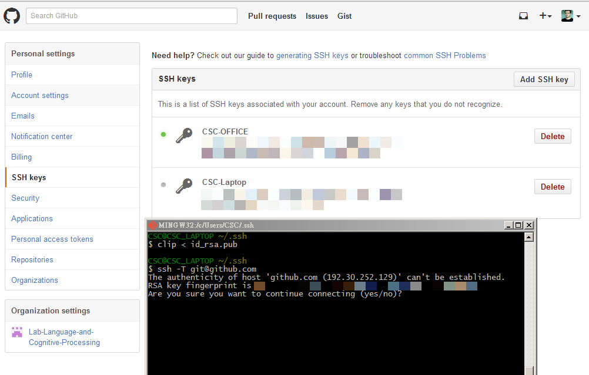  
    + 出現如下圖顯示的訊息，就表示已經成功啟動：  
    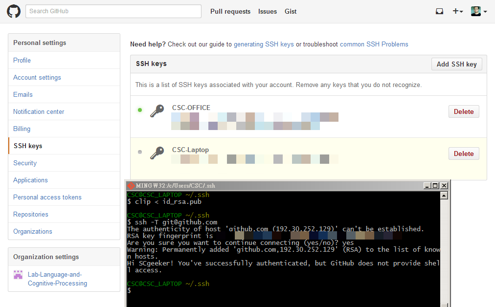  
    + 回到github設定頁面，更新瀏覽器，看看前面的圓點是否變綠？  
    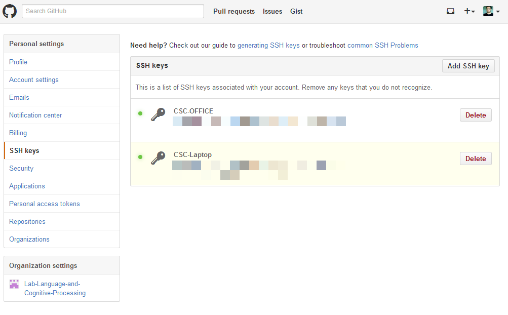