* 此處的專案管理包含資料處理與分析過程所產生的資料集合、程式碼以及編碼說明文件。只要每次工作，有兩件以上檔案必須同時處理，整體內容就是一件專案。不論檔案內容是什麼型式，放在同一個資料夾，並給予資料夾名稱，就是宣告一件專案成立。
* 在此依照管理方法的難易度介紹創建R專案的方法：

1. <a href='#1'>從已建好的資料夾創建R專案</a>
    + <a href='#1A'>自建專案</a>
    + <a href='#1B'>使用他人專案</a>
    + <a href='#1C'>建議</a>
2. <a href='#2'>運用版本控制系統創建R專案</a>
    + <a href='#2A'>前置準備</a>
    + <a href='#2B'>自建專案</a>
    + <a href='#2C'>同步他人專案</a>
    + <a href='#2D'>建議</a>
  
###<a name='1'>這個方法適合還未習慣使用版本控制系統的使用者</a>
* <a name='1A'>從已存在的資料夾自建R專案</a>  
    + 一般資料處理與分析必定有儲存資料的檔案(格式可能是txt,csv,xlsx...)，以及處理資料的R腳本。例如下圖的情況：  
        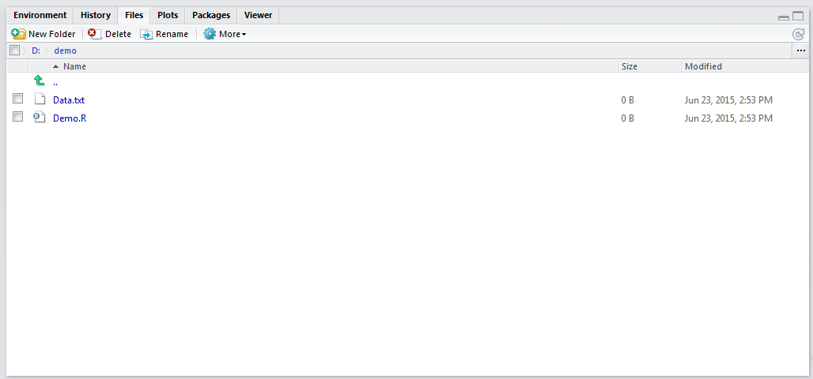  
    + 要將這個資料夾建立成R專案，在Rstudio右上角按下下圖的按鈕，出現如下圖的選單，選擇**New Project**。  
        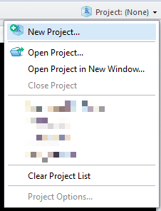  
    + 在新出現的**New Project**視窗選擇第二項**Existing Directory**。
        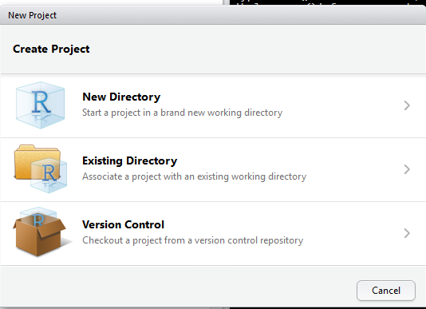  
    + 設定存放資料夾的目錄位置。  
        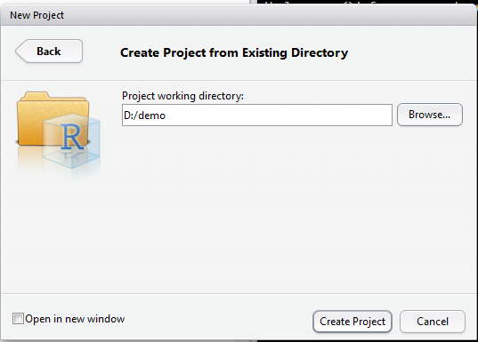  
    + 按下"Create Project"，回到Rstudio，檢視*Files*頁面，發現增加一個檔案`demo.Rproj`。  
        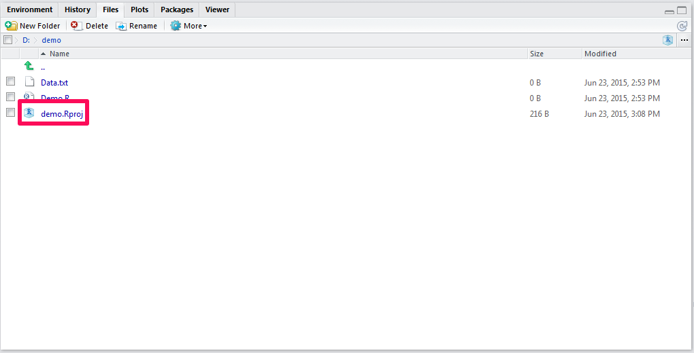  
    + ####以後只要在檔案總管點擊`demo.Rproj`，就能直接開啟Rstudio，並直接在指定目錄下工作。
          
* <a name='1B'>使用他人已建好的R專案</a>
    + 你將完成的專案壓縮後傳給別人，或者他人將完成的專案打包給你。運用此法可在自已的Rstudio開啟R專案。
    + 要打開R專案前，**確認內容已有該專案名稱的`.Rproj`**。
    + 配合其它章節的示範，筆者使用鄭中平老師與許清芳老師所著**R在行為科學之應用**做為示範。[作者的個人網站](http://myweb.ncku.edu.tw/~cpcheng/Rbook/index.htm)已公佈程式碼與範例資料集，筆者已將全部資料整理到自已的github，點擊這個[連結](https://github.com/SCgeeker/CH_R_Meta)，進入下圖的頁面：  
        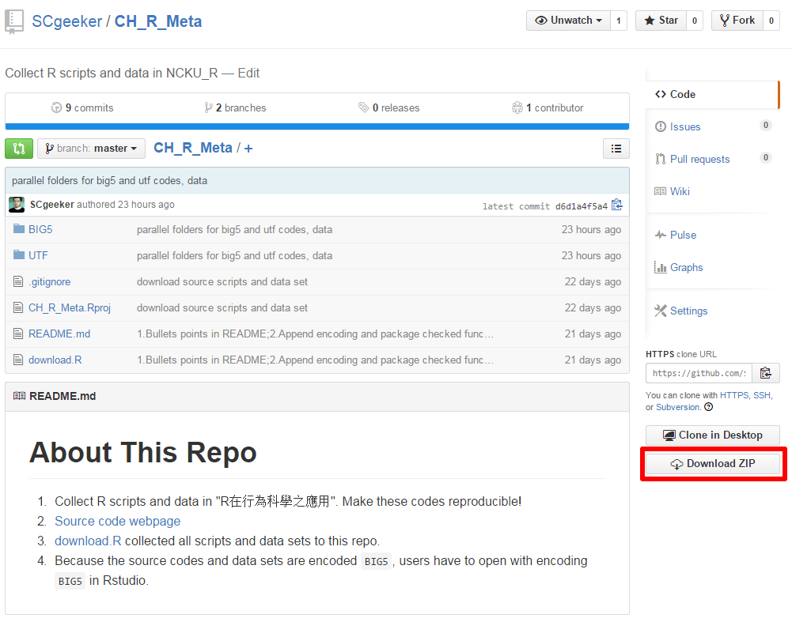      
    + 上圖標記的按鈕*Download ZIP*，點撃下載整份Repo的ZIP檔案。解壓縮到個人習慣存放的資料夾，點擊`CH_R_Meta.Rproj`，就能開啟Rstudio檢視內容。
  
* <a name='1C'>建議</a>
    + 
  
###<a name='2'>這個方法適合已經習慣使用版本控制系統的使用者</a>
* <a name='2A'>前置準備</a>  
    + 參考[Git版本控制](Git.html)一節，確定使用Rstudio的電腦已經安裝並設定Git，以及已經有可使用的個人github帳號。  
    + 設定Rstudio背景參數。從Rstudio上方選單選擇Tools -> Global Options -> **Git/SVN**，到達如下圖的頁面。  
  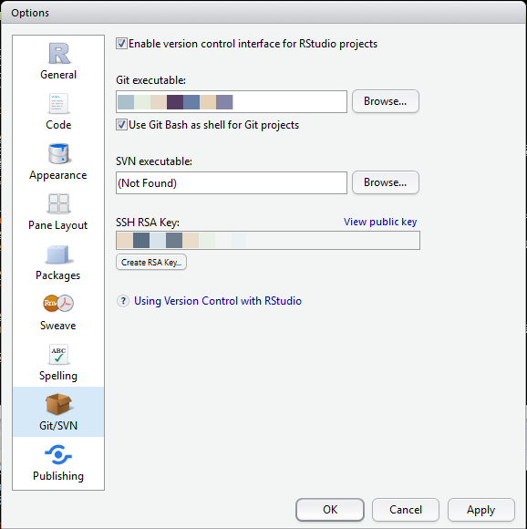    
    + 在**Git/SVN**要整合已安裝的Git版本控制系統。從Git executable這欄，輸入或選擇安裝好的git.exe路徑名稱，例如`C:/Git/git.exe`。  
    + github帳號開通後，必須在git bash中設定以下參數，**Git/SVN**頁面的最後一欄SSH RSA key才能設定正確檔案。  
    ```
    git config --global user.name "your_github_name"
    git config --global user.email "yours@email.com"
    ```
  
* <a name='2B'>從Github Repo自建R專案</a>  
    + 筆者使用教學用github帳號`CSCsandbox`，示範如何創建本機與github同步的R專案。
    + 從自已的github頁面，點擊**New repository**創建一個存在github的Repo，如下圖頁面示範。  
  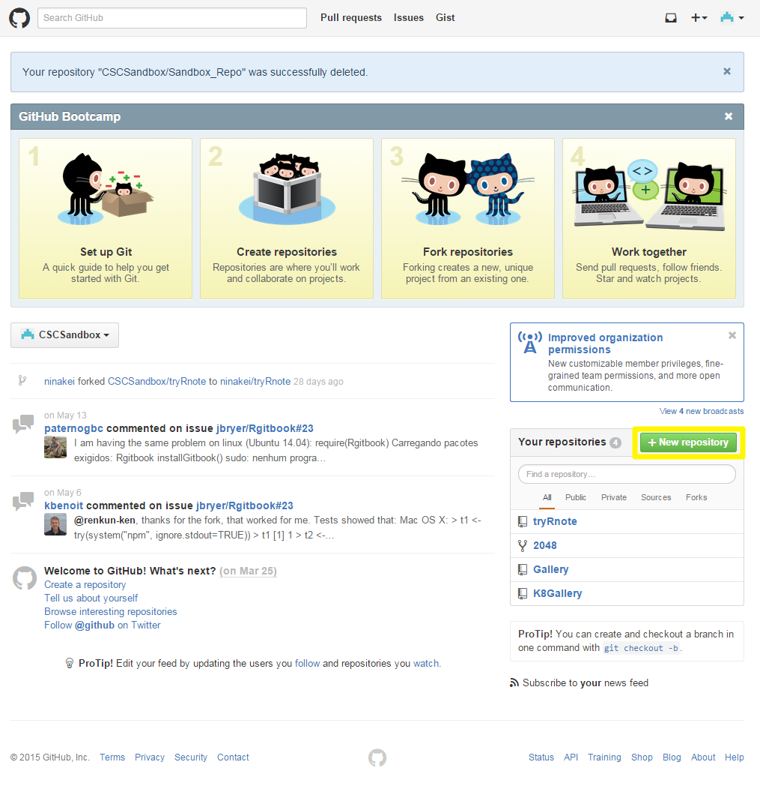    
    + 新建Repo設定頁面，這個頁面的所有設定日後都可以更動，此處解說重要選項。(1)專案名稱，必填！一般以英文字母與數字命名；(2)專案摘要描述，選填。如果這是個要長期維護的專案，建議加些說明。不限使用語言文字；(3)創建後系統自動建立README.MD。預設是不建立，如果要註記專案內各檔案作用，應建立README；(4)設定gitgnore，專案屬性。github提供許多標記，這是以R為主的專案，所以筆者選擇標記`R`；(5)設定授權方案。如果這個專案要提供他人使用，選擇一種開源授權方式：  
  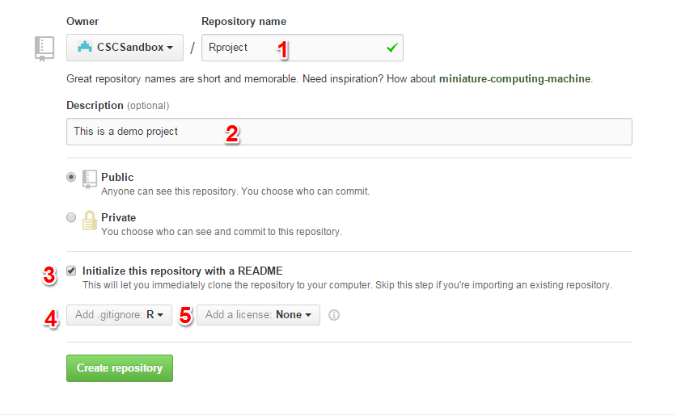        
    + 以上設定完成直接按**Create repository**，等於在github端完成`git init`，完成頁面如下圖。  
  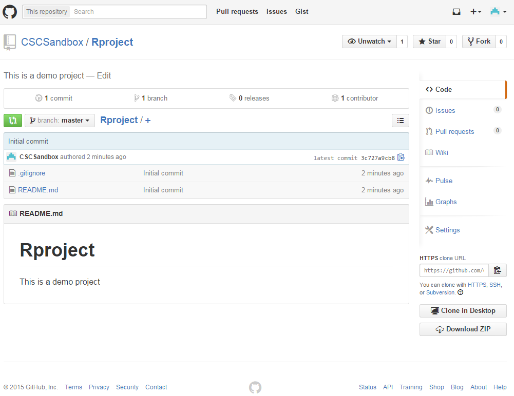  
    + 回到Rstudio，從右上角的Project按鈕選擇新建project:  
          
    + 這次要在在新出現的**New Project**視窗選擇第三項**Version Control**:  
          
    + 在這個步驟選擇**Git**:  
        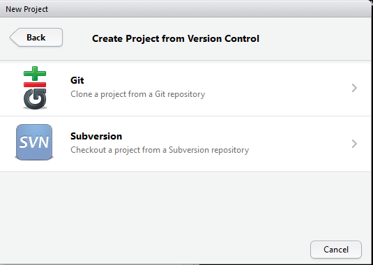  
    + 從瀏覽器網址複製剛創建的Repo網址，貼到Repository url。如果SSH RSA key設定正確，第二欄會直接帶出Repo名稱。第三欄是使用者本機端存放專案的路徑，依使用者習慣設定。  
        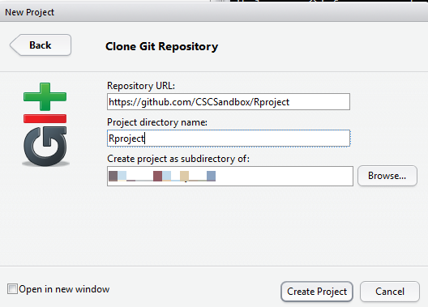  
    + 在上圖視窗按下**Create Project**，Rstudio開始將github端的Repo下載到指定路徑，完成後Rstudio顯示內容，比對下圖與github端的內容。
        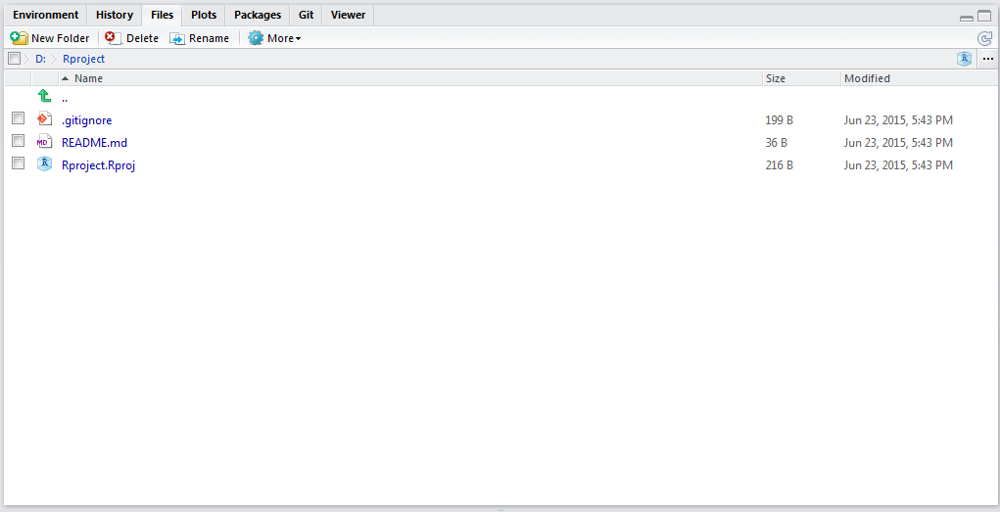   
    + 以後可在本機端維護專案內容，如可配合Git請參考[Git版本控制](Git.html)一節。後續可重製研究案例示範，將再說明如何同步更新內容到github端。
  
* <a name='2C'>同步他人公開在Github的專案</a>
    + 此處示範如何同步筆者放在github的**R在行為科學之應用**示範內容。首先要Fork這個Repo到自已的個人帳號，如下圖的標示。
        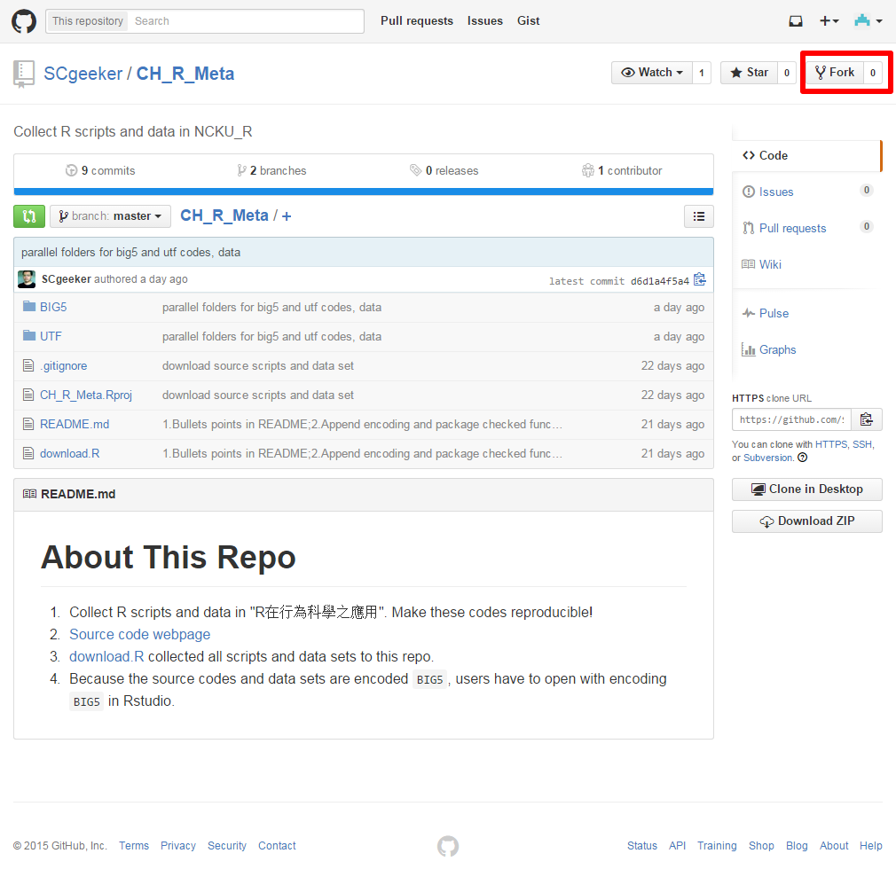   
    + 進行Fork的過場畫面：  
        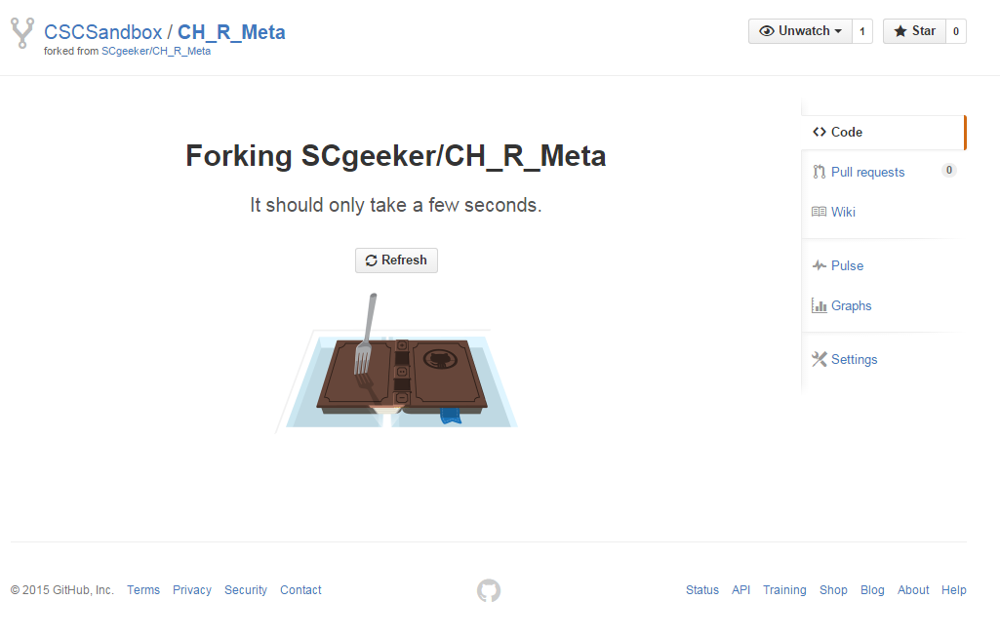
    + 完成Fork的頁面，比較和原始頁面的不同之處：  
        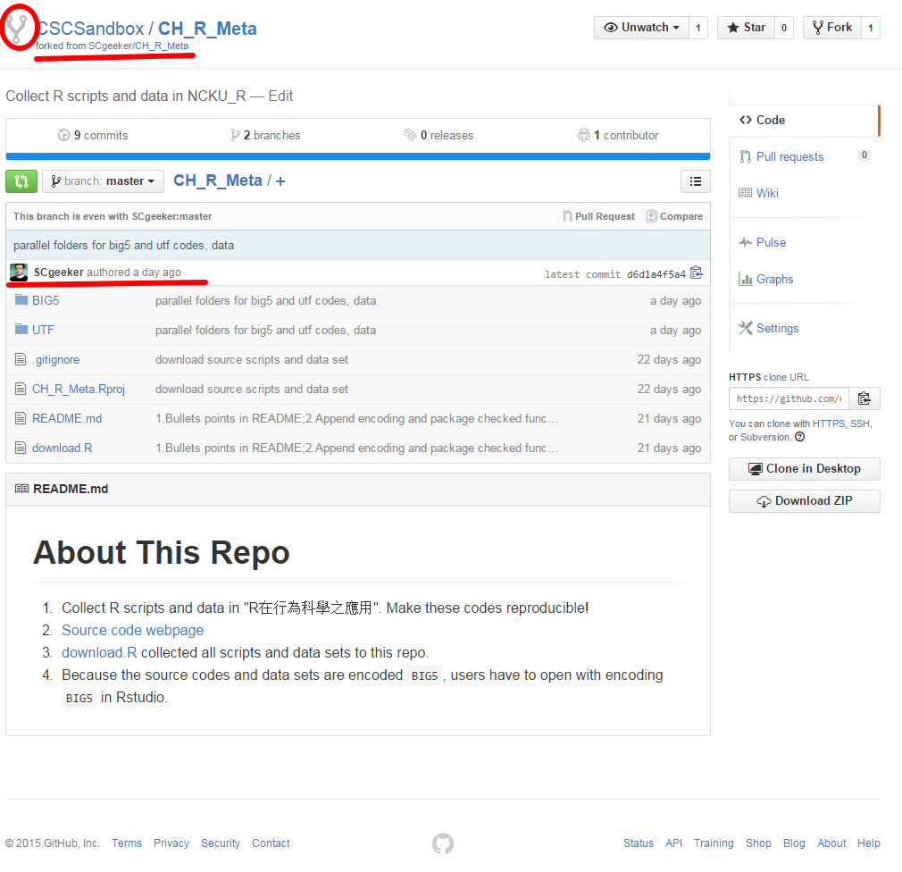    
    + 回到Rstudio，創建整合Git的R專案，這次在這個步驟貼上Fork過來的頁面網址：  
        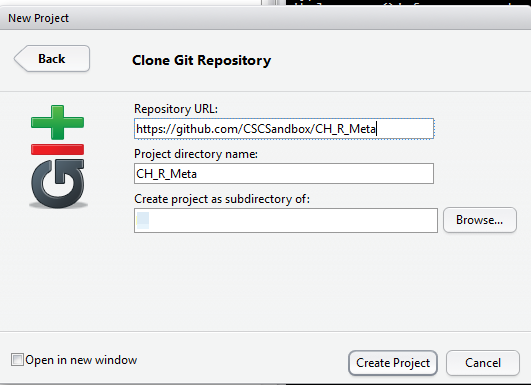
    + 按下**Create Project**，Rstudio開始將筆者整理的內容Clone到使用者的電腦裡，下圖是完成畫面：  
        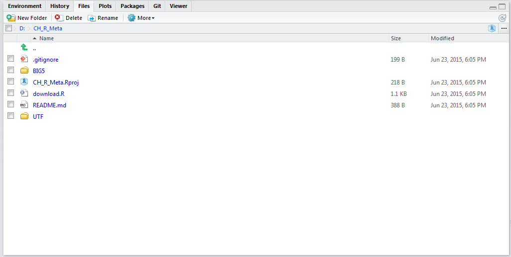     
    + Fork到自已github帳號的Repo不能同步本機端的更新內容，因為只有筆者對此Repo有更新的權限。使用者如果要更新內容，可建立新的專案，或者與筆者聯絡分享權限，或者使用pull request更新。  
  
* <a name='2D'>建議</a>
    + 
  
  