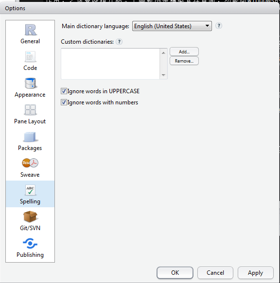

```{r knitsetup, echo=FALSE, results='hide', warning=FALSE, message=FALSE, cache=FALSE}
opts_knit$set(base.dir='./', fig.path='', out.format='md')
opts_chunk$set(prompt=TRUE, comment='', results='markup')
# See yihui.name/knitr/options for more Knitr options.
##### Put other setup R code here


# end setup chunk
```
---
title: "安裝與更新R與Rstudio"
author: "陳紹慶"
output: html_document
---

1. <a href='#1'>第一次安裝</a>
    + <a href='#1A'>安裝R</a>
    + <a href='#1B'>安裝Rstudio</a>
    + <a href='#1C'>設定Rstudio</a>
2. <a href='#2'>更新R與Rstudio</a>
    
###<a name='1'>如果你還沒有安裝R與Rstudio，請依照以下步驟安裝與設定</a>  
* <a name='1A'>下載與安裝最新版R</a>
    + [R官方網站首頁](http://www.r-project.org/)的最新消息有最新版R的連結  
    
    + 首頁左方有CRAN鏡像伺服器，提供全球各地能下載R主程式與套件(package)的伺服器網址。這裡以台灣大學CRAN mirror為例，點入[連結](http://cran.csie.ntu.edu.tw/)，可見到以下畫面：  
    
    + 使用者根據自已使用的作業系統，點選對應的連結，下載符合作業系統的安裝程式。這裡以Windows為例，點入[Download R for Windows](http://cran.csie.ntu.edu.tw/)，可見到以下畫面：
    
    + 點選*base*，進入介紹安裝程式的頁面，這個頁面隨最新版本發布不定期更新，以下是2015/6/18發佈3.2.1的頁面：
  
    + 下載完成後，直接執行安裝程式。安裝過程有詢問作業系統是32bit或64bit的步驟，根據個人的windows系統版本選擇即可。這裡建議安裝在自設的應用程式路徑，例如**D:\APP\R**。其它步驟皆選預設選項即可。  
    
* <a name='1B'>下載與安裝最新版Rstudio</a>
    + [Rstudio官方網站首頁](http://www.rstudio.com/)的最新消息與連結區塊[Powerful IDE for R](http://www.rstudio.com/products/RStudio/)，都可點選進入產品頁面。如下圖的標示：  
  
    + Rstudio有個人使用的Desktop版，以及單位團體使用的Server版。這裡以安裝與設定Desktop版為例：
  
    + 再往下捲動或點選**Desktop**會出現下載連結。如下圖：
  
    + 點選**DOWNLOAD RSTUDIO DESKTOP**，進入安裝程式下載頁面。如下圖，根據自已的作業系統，下載適合的版本：
  
    + 除了建議安裝在自設的應用程式路徑，例如**D:\APP\Rstudio**，其它安裝步驟皆選預設選項即可。
    + 安裝完成後，點擊桌面或開始功能表的Rstudio圖示，成功執行會見到Rstudio IDE預設介面，見下圖：
  
  
* <a name='1C'>設定Rstudio</a>
    + Rstudio IDE包含完善的R套件管理介面，如果想要使用非預設的R套件，建議設定好IDE背景參數，再來管理R套件。  
    + 建議使用Rstudio IDE管理R套件的更重要理由，是Rstudio開發許多在Rstudio才能完整執行的套件，例如Rmarkdown。使用Rstudio編修LaTex與網頁文件，也比較容易。  
    + Rstudio提供的專案功能，能讓使用者根據工作需要，將相關的檔案打包在一個資料夾，並能配合版本控制系統(如Git)管理專案內容。專案功能在下一節介紹。  
    + 下圖是筆者習慣使用的Rstudio介面。以此介紹如何調整設定，得到和筆者一樣的介面：  
  
    + Rstudio介面分為四大區塊，對照下圖說明各區塊的作用。(1)Source區塊，腳本或文件編輯區。使用Rstudio開啟一個R腳本或Rmarkdown文件，這個區塊才會出現。下圖例子是筆者編輯本頁內容的擷圖；(2)Console區塊，指令與訊息區。如同原版的R console，使用者可直接在此輸入與執行R指令與腳本。執行程式的回應訊息也會在此顯示，例如轉換Rmarkdown為其它格式文件的過程，訊息也會顯示在此；(3)專案環境管理區塊。筆者將幫助(help)以外的管理介面集中於此區塊，此區塊包含的不同頁面各有作用，之後會陸續介紹。下圖範例是檔案管理頁面，功能同Windows的檔案總管，可以由此打開使用者想編輯的文件；(4)幫助文件介面。在R console執行help()會跳出的頁面，因為只有要找參考資料時才會用到，筆者的習慣是平常將之縮小，顯示空間留給專案環境管理區塊。   
      
    + 從介面最上方的選單，選擇Tools -> Global Options，跳出以下畫面。這是0.99.447版本的選項設定畫面，從第一個頁面**General**逐一介紹。**General**設定IDE與R版本的連結，預設工作路徑，以及預設開啟狀態等。下圖標示處是使用者第一次應調整的設定：*R version*決定用連結已安裝在電腦裡的R版本，有經驗的R使用者因為工作需要，有必要使用較舊版本的R，才能執行某些套件，這項設定可讓使用者因應需要切換，預設是連結最新更新的版本。*Default working directory*是開啟Rstudio IDE，專案環境管理區塊會顯示的資料夾路徑，有經驗的使用者會在所有處理過的腳本及資料存在特定資料夾，建議依個人使用習慣設定。*Default text encoding*是Rstudio對腳本及資料的預設開啟編碼，建議設為UTF-8，自已完成的檔案與他人交換較無轉碼的問題。  
     
    + 第二個頁面**code**決定腳本編輯頁面的設定。Rstudio致力整合R與各種程式語言，因此0.99.447的這個頁面已增加到4個次頁面。筆者只有調整下圖標示的*Tab width*，這是根據[Roger Peng的建議](http://datasciencespecialization.github.io/courses/02_RProgramming/CodingStandard/#1)，讀者可依自已的編程習慣調整。  
     
    + 第三個頁面**Appearance**決定Source與Console兩個區塊的顯示模式，想得到如同筆者一樣的顯示模式，參考下圖調整即可。  
         
    + 第四個頁面**Pane Layout**決定IDE四個區塊的顯示相對位置，想得到如同筆者一樣的介面排列，參考下圖調整即可。  
         
    + 第五個頁面**Packages**決定安裝額外R套件的下載伺服器，以及使用者自行開發R套件的預設參數。如果要安裝的套件已經由CRAN發佈，Rstudio會根據使用者在這裡的設定，從指定伺服器下載套件。使用者可根據自已的實際需要更改伺服器。  
             
    + 第六個頁面**Sweave**設定Rmarkdown與LaTex文件的處理程式，建議先將下圖標示處改為*knitr*，之後介紹Rmarkdown會說明Sweave設定的作用。  
             
    + 第七個頁面**Spelling**設定編輯一般文件的拼字檢查功能，如同WORD的拼字檢查。這個頁面提供拼字檢查參考的字典來源，現在還未支援中文。  
             
    + 第八個頁面**Git/SVN**設定與Rstudio整合的版本控制系統。Rstudio可整合Git與SVN兩種系統，筆者使用的是Git。設定方法在[R專案](Project.html)有詳細介紹。  
  
    + 第九個頁面**Publishing**設定使用者開發產品的發佈管道。Rstudio另一個知名產品是[shiny](http://shiny.rstudio.com/)，如果使用者想發佈自製的Shiny App，Rstudio 0.99.447開始支援全程開發與發佈。有興趣的讀者可自行尋找相關資料，未來這本書有需要改版，會再增加一節介紹。  
  
  
###<a name='2'>如果你已經安裝R與Rstudio，請依照以下建議檢查更新與進行更新</a>  
* R與Rstudio是各自獨立的應用程式，如果有需要進行更新，應分別處置。
* 完成更新後，只要在Rstudio的**General**設定中確認連結最新版R，即可在Rstudio中使用最新版的R套件。
* R的更新訊息無法從應用程式獲得告知，使用者可訂閱[官方經營的blog](http://www.r-bloggers.com/)得到消息。下圖是2015/6/19發佈的3.2.1版釋放訊息：  
    
* Rstudio可從應用程式獲得更新訊息，確定**General**設定的最後一項有勾選即可。  
* R與Rstudio的更新方法都是到官網下載最新版安裝程式，重新進行<a href='#1'>第一次安裝</a>描述的步驟。  
* R提供下載安裝最新版的指令，只要安裝`installr`套件，在R Console執行以下指令：
```
installr::updateR(keep_install_file=TRUE)
```
* 如果硬碟空間足夠，更新過程可選擇將所有舊版套件複製到新版目錄，並在舊版資料夾保留。  
