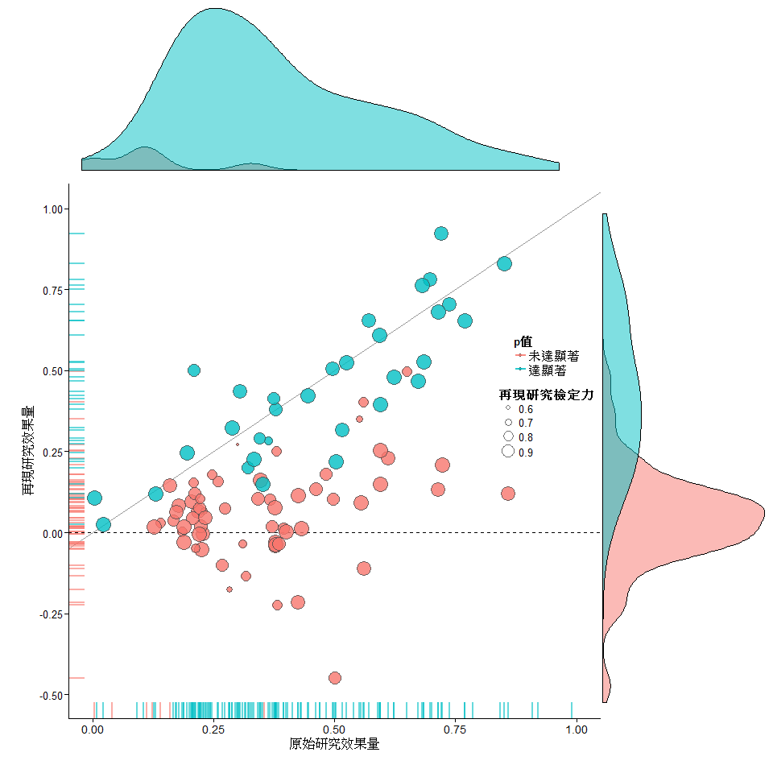

1.必須開放的資料  
公開的資料足以讓他人完整重製刊登於論文的圖表及數據，並在保持內容意義不變的條件下，他人可以適度修改，就是符合狹義可重製的基本要求。除了產生圖表數據的**資料檔**以及**程式碼**，也要提供他人可查找變項屬性的**資料編碼簿**(codebook)。以下示範從RP:P的開放網址下載，並顯示前6行的內容。讀者可以看到編碼簿的必備訊息有*資料變項名稱*、*變項內容描述*、以及*資料型態*。懂得處理資料的讀者，可以從資料編碼簿掌握處理對應變項的程式碼，以及處理變項的數值方法。  

```{r Codebook, cache=TRUE, warning=FALSE, message=FALSE}
info <- GET('https://osf.io/bhcsf/?action=download', write_disk('rpp_data_codebook.csv', overwrite = TRUE))
codebook <- read.csv("rpp_data_codebook.csv")
head(codebook[,c(1,2,5)])
```

只要讀者知道網址，已公開的**資料檔**以及**程式碼**都可以用相同的方法下載與檢視內容。現在只要在osf.io設定為公開的專案，都可以運用上述的程式碼，透過R下載檔案。如果讀者能熟悉[前一章](../2_init/Git.html)介紹的Git版本控制系統，就能有系統管理自已有興趣追蹤的資料。

2.為何要開放這些資料  

許多著名的學術研究造假案件是發表於論文的圖表數據過於美好，被有心的讀者抓包所致，近期知名的案例是[日本STAP幹細胞研究][1]。推動所有實驗研究的發表，要達成狹義可重製的條件，不只是打擊個人美化數據圖表的意圖，更是促進有效研究的規劃。能讓他人迅速取用，並檢視內容的**資料檔**與**程式碼**，都是研究計畫形成時一起規劃的，格式與內容完整的**資料編碼簿**，更是撰寫計畫書與論文報告的良伴。其它研究者能有效地檢視數據圖表之間的訊息正確性，減低過度追求統計顯著結果的人為主觀偏誤。  

3.重製圖表～以RP:P為例  

RP:P刊登於[Science網頁版的摘要][2]，附上一張呈現整份專案成果的統計圖。為避免部分讀者無法直接瀏覽Science網頁，我從[孫學軍的博客](http://blog.sciencenet.cn/blog-41174-916523.html)轉載這張統計圖。  


圖內每個圓圈的座標，代表一項實驗的原始研究與再現研究的效果量，對應兩個座標軸上的同色刻線。藍色圓圈代表該項實驗的原始與再現研究都得到統計顯著的結果，紅色圓圈代表該項實驗的原始與再現研究沒有得到一致的顯著結果。圓圈大小代表該項實驗的再現研究檢定力。與多數藍色圓圈交集的直線，是原始與再現研究效果量相等的情況。這篇論文最重要的結果：只有38%的原始研究成果能被再現，呈現在座標軸上的著色刻線密度，以及散佈圖邊的機率密度分配圖。

這張圖的來源資料彙整於[rpp_data.csv](https://osf.io/fgjvw/)的資料，原始程式碼來自[RPP_figures.R](https://osf.io/tfbe8/)。為了讓讀者了解如何重製，這份文件以Rmarkdown撰寫，再製原圖於下方，並將圖中的標示文字改為中文。讀者可以[點此](01.Rmd)檢視產生下圖的R程式碼，我在程式碼中加入的中文註解，是能完整重製這張圖要做的準備。

```{r FIG3, echo=FALSE, warning=FALSE, message=FALSE, results='hide', cache=TRUE}
# Widonws系統要安裝devtools套件前，請先下載安裝對應版本的Rtools(https://cran.r-project.org/bin/windows/Rtools/)。例如安裝的R版本是3.1.3，要安裝Rtools32.exe；安裝的R版本是3.2.2，要安裝Rtools33.exe。

library(devtools)
source("../Materials/RP.P/C-3PR.R")  # 原始程式碼含兩個多位元組字符 \u2717 and \u03C1 ,此版本已置換為unicode
in.IT(c('ggplot2','grid','RColorBrewer','lattice','gridExtra','plyr','dplyr','httr'))  # 增加grid套件，確保ggplot繪圖正常
  RPPdata<-read.csv('../Materials/RP.P/rpp_data.csv',stringsAsFactors=F )  # 原始資料檔的欄位(BF,94)有多位元組字符，讀取後造成資料欄位錯置，此下載版已修正
  RPPdata<-df.Clean(RPPdata)
  RPPdata<-RPPdata$df

# Get ggplot2 themes predefined in C-3PR
mytheme <- gg.theme("clean")

##############
RPPdata$Power.Rn <- as.numeric(RPPdata$Power.R)

# Setup some variables
RPPdata$oriSig <- "未達顯著"
# 3 studies claimed an effect at .05 < p < .06
RPPdata$oriSig[RPPdata$T.pval.USE.O<=.06] <- "達顯著"
RPPdata$oriSig <- factor(RPPdata$oriSig)

RPPdata$repSig <- "未達顯著"
RPPdata$repSig[RPPdata$T.pval.USE.R<=.05] <- "達顯著"
RPPdata$repSig <- factor(RPPdata$repSig)
RPPdata$repSig <- factor(RPPdata$repSig)

# Create a scatterplot with density margin plots

# The plotHolder() function from C-3PR creates a blank plot template that will hold the figures
blankPlot <- plotHolder()

# X margin density plot (note: gg.theme() from C-3PR can be used directly in a ggplot2() call)
xDense <- ggplot(RPPdata, aes(x=T.r.O, fill=oriSig)) + 
  geom_density(aes(y= ..count..),trim=F,alpha=.5) + 
  xlab("") + ylab("") + xlim(0,1) +
  gg.theme("noax") + 
  theme(legend.position = "none",plot.margin = unit(c(0,0,0,4), "lines"))

## Uncomment to save subplot
# ggsave("RPP_F3_xDense.png",plot=xDense)

# Y margin density plot (note: gg.theme() from C-3PR can be used directly in a ggplot2() call)
yDense <- ggplot(RPPdata, aes(x=T.r.R, fill=repSig)) + 
  geom_density(aes(y= ..count..),trim=F,alpha=.5) + 
  xlab("") + ylab("") + xlim(-.5,1) + 
  coord_flip() + 
  gg.theme("noax") + 
  theme(legend.position = "none", plot.margin = unit(c(0,0,3,0), "lines")) 

## Uncomment to save subplot
# ggsave("RPP_F3_yDense.png",plot=yDense)

# The main scatterplot (note: gg.theme() from C-3PR can be used directly in a ggplot2() call)
scatterP<-
  ggplot(RPPdata,aes(x=T.r.O,y=T.r.R)) +  
  geom_hline(aes(yintercept=0),linetype=2) +
  geom_abline(intercept=0,slope=1,color="Grey60")+
  geom_point(aes(size=Power.Rn,fill=repSig),color="Grey30",shape=21,alpha=.8) + 
  geom_rug(aes(color=oriSig),size=1,sides="b",alpha=.6) + 
  geom_rug(aes(color=repSig),,size=1,sides="l",alpha=.6) + 
  scale_x_continuous(name="原始研究效果量",limits=c(0,1),breaks=c(0,.25,.5,.75,1)) + 
  scale_y_continuous(name="再現研究效果量",limits=c(-.5,1),breaks=c(-.5,-.25,0,.25,.5,.75,1)) + 
  ggtitle("") + xlab("") + ylab("") + 
  scale_size_continuous(name="再現研究檢定力",range=c(2,9)) + 
  scale_color_discrete(name="p值") +
  scale_fill_discrete(name="p值") +
  gg.theme("clean") + 
  theme(legend.position=c(.9,.6), plot.margin = unit(c(-2,-1.5,2,2), "lines")) 

## Uncomment to save subplot
# ggsave("RPP_F3_scatter.png",plot=scatterP)

# Yet another way to organise plots: grid.arrange() from the gridExtra package.

png(file = "RPP_FIG3.png", width = 960, height = 960)
grid.arrange(xDense, blankPlot, scatterP, yDense, ncol=2, nrow=2, widths=c(4, 1.3), heights=c(1.3, 4))
dev.off()
```
<center></center>


[1]: https://zh.wikipedia.org/wiki/%E5%88%BA%E6%BF%80%E8%A7%B8%E7%99%BC%E6%80%A7%E5%A4%9A%E8%83%BD%E6%80%A7%E7%8D%B2%E5%BE%97%E7%B4%B0%E8%83%9E  "STAP"

[2]: https://www.sciencemag.org/content/349/6251/aac4716.abstract  "Estimating the reproducibility of psychological science"