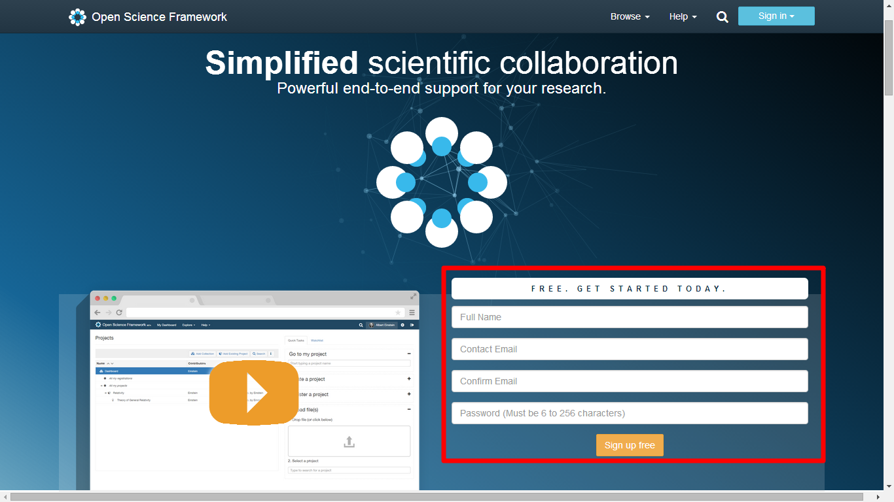
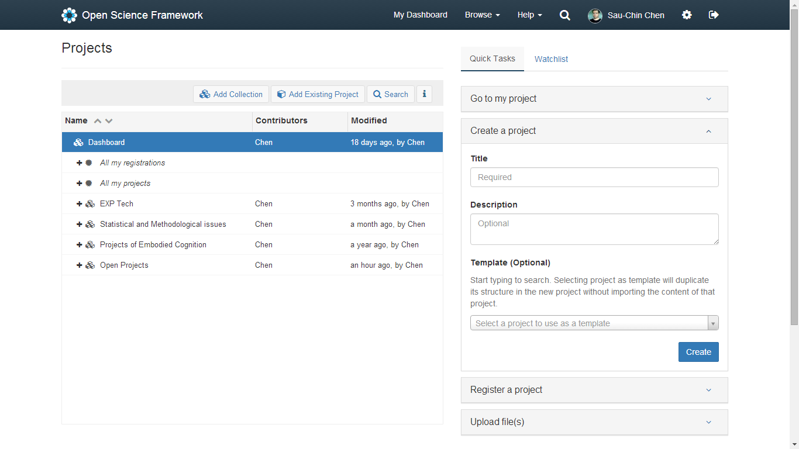
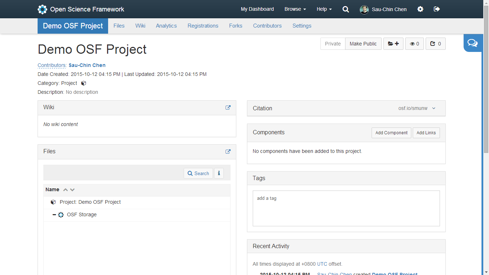
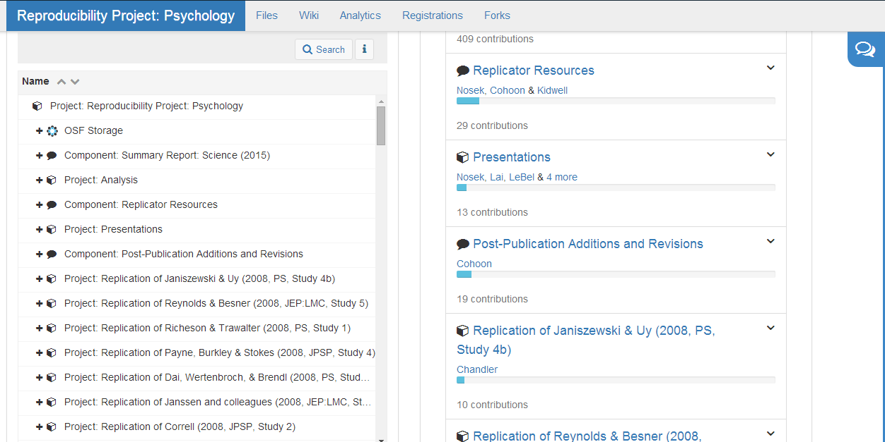

## 1.構成協同合作要素  

協同合作是人類能創造集體文明的動力，可以說只要有合適的條件，你我都能為相同的目標進行協同合作。許多對人類產生重大影響的科學研究成果，都是至少二位以上參與者協同合作的產物。簡單地說，廣義可重製的科學研究，成功條件只有一項：將研究開始到結束的協同合作過程完整公開。包括從開始確定具體假設，到發表實際成果之間的過程，產生的任何紀錄或資料，都是協同合作的證據。讓這些紀錄與資料以共同約定的標準產生與保存，他人能在評審研究成果或深度閱讀論文時，檢視研究過程中可能造成問題的細節。  
形成良好的協同合作，需要參與人員的執行意志與維持意志的措施。在這個版本裡，本文集中探討維持意志的措施。我主張一個有效維持執行意志的措施，就是每個步驟約定共同遵守的達成標準。例如確定獨變項A是操作刺激的三種呈現方式，備齊三種呈現方式的刺激物，就是參與人員要遵守的達成標準。
因為多數實驗操作的變項不只一樣，許多項目的達成標準需要使用版本控制系統管理，才能給予參與人員達成目標的彈性。如何使用控制系統管理達成標準，資料編碼簿(codebook)是一件可運用的道具。談「狹義可重製」提到的資料編碼簿，是在開始收集資料之前，就應該準備好的文件。資料編碼簿的成形時機，是研究者已經確認所有納入的變項是要操作、控制、測量與準備進行控索性分析用的。變項的定義與資料內容來自研究的假設，以及方法設計。
因為資料編碼簿的結構性質，我建議研究者可利用自已熟悉的程式語言，撰寫生成資料編碼簿的程式碼，使用程式碼的註解模式，置入完成各欄位的達成標準。註解文字能輕易轉換成markdown文件，參與人員能立即運用於紀錄或報告，讓團隊即時得知最新進度。

## 2.如何維持協同合作  

維持協同合作的關鍵在於參與者願意付諸實現的意志。不只是完成計畫目標，還有一起紀錄過程細節的意願。進行科學研究如同建築工程，需要進行一段時間，而且可能發生預期之外的狀況，需要調整執行細節或排除問題。發生考驗維持協同合作意志的狀況，也是有可能發生的情節。所幸網路社群平台的普及，已有促進各式專案的協同合作平台誕生，值得正在科學研究前沿奮鬥的研究者，花點工夫上手與適應。  
因為各種研究領域的工作模式不同，至今都還沒有誕生一套能適用所有科學研究工作者的協作平台。這個版本的主張最佳模式，是能整合研究者已經慣的協作工具，例如多數網路使用者都會註冊的google drive套件、同步不同電腦資料的Dropbox。有協作意識的研究團隊，都會使用這些工具交流研究資料。但是要維持協同合作的意願，這些工具並未設計讓參與人員檢視各項工作約定標準，以及達成狀況的自動紀錄。  
接下來介紹開放科學平台(osf.io)的角度，採用如何維持協同合作執行標準的角度，做為示範的取材方向。因為開放科學平台 尚未開發到穩定版本，現在示範的細節，很可能下次改版就會改變或失效。如果有這樣的情況，這份文件會更新內容，也請讀者留意並回饋給我。  

## 3.開放科學平台:示範與訣竅  

### (1)註冊
因為osf大量使用HTML5功能與google api，建議使用chrome瀏覽器連上[首頁](https://osf.io/)。第一次使用者請先註冊，在首頁右下的註冊欄(見下圖紅框處)，填入個人英文姓名、常用的電子郵件帳號與自設密碼。按下*Sign up free*之後，到自已的電子郵件信箱收取確認信。完成確認程序，就可以從首頁右上角的*Sign in*，填入電子郵件帳號與自設密碼，正式登入osf。   
 

### (2)專案入口頁
首先展示我的登入頁畫面。 

第一次登入的讀者看到的畫面會與上圖有些微差異，借此說明畫面中的介面功能。登入的畫面有三個主要介面:   
 
* 儀表板(Dashboard)  
列出使用者自行創建或加入的專案，以及收集未加入但公開的專案。儀表板的功能與操作方式，都很類似Windows系統的檔案總管。第一次登入的使用者，儀表板只有*All my registerations*與*All my projects*兩個項目。兩個項目都是資料夾，現在應該沒有任何專案。如果你正參與一項研究專案，請和你的夥伴推舉出一位專案領導人，由專案領導人負責開設一項新專案。當你自已開設專案，或者 專案領導人將你加入專案，就會在*All my projects*看到專案名稱，往後都可由此點擊進入你的專案。   
讀者也可以自行收集其它osf使用者建立的公開專案，畫面中的儀表板上方*Adding Existing Project*與*Search*都可以搜尋想收集的專案，找到並確認後，就會在*All my registerations*與*All my projects*之外，看到收集的專案名稱。使用者也可以自設資料夾*Add Collection*，分類集中收集的專案名稱。  

* 快速功能列(Quick Tasks)
這裡包含四種功能：*前往專案頁面*(Go to my project)，*創建專案*(Create a Project)，*註冊專案*(Register a project)，以及*上傳檔案至專案*(Upload file(s))。  
*前往專案頁面*的功能與從儀表板點擊專案名稱相同，只是這裡是自行輸入專案名稱，不過這裡還可鍵入專案內元件名稱，網頁會自動帶出符合輸入名稱的專案或元件連結，喜歡打字的使用者可以用此功能前往要作業的專案區域。 
*創建專案*就是每一項專案領導人要做的第一步，只要輸入專案名稱(Title)，按下*Create*，一項專案頁面就會產生。其它兩項Description與Templete是自選設定，這個文件版本暫不介紹。也許讀書會想問：如果和別人的專案撞名怎麼辦？稍後「專案設計」將介紹osf的專案引用條(citation)，了解開發團隊如何解決問題。 
*註冊專案*是將個人與夥伴維護的專案，註冊為封存專案。一項專案確定註冊後，會移到*All my registerations*。封存專案內容無法變更，且會完全公開，通常這是一項專案結束並完成發表之後，才會註冊封存。封存專案會成為開放取用的公共財產，其它研究者能運用封存專案內容建立新的研究專案，這也是目前已知廣義可重製的最佳模式。　　
*上傳檔案至專案*的視覺化操作界面，讓使用者能從個人上網設備，包含手機與平板，上傳資料至參與的專案。如果讀者手邊有可上網的手機或平板，可嘗試使用這項功能，上傳資料到osf，因為osf網頁是以跨平台框架設計。 
 
* 專案更新提示(Watchlist)
這部份是針對你想追蹤的專案更新狀況。只要在自已或他人專案頁設定追蹤，專案的更新狀況會依時間順序列於此處，並可點擊連結至專案頁面。如何設定要追蹤的專案，在稍後的「專案設計」說明。  
 
最後介紹畫面最上方的功能介面，這列功能介面在後續的任何操作，都會保持在畫面最上方。最左邊osf logo是往登入前畫面的連結，*My Dashboard*是指向上圖–剛登入的初始畫面。因此往後操作過程發現自已忘記作業目的，可點擊這兩個連結回到初始畫面。*Browse*是osf開發團隊推薦的三種專案搜尋模式，有興趣的讀者可以試試。*Help*顧名思義就是提供解決操作問題的指引，其中一項*Get Started*，整理開放科學中心釋出的osf示範影片，建議第一次使用的讀者先看看，部分專案元件的介紹會配合影片說明。*放大鏡*會顯示搜尋列，讓使用者根據關鍵字，尋找已登記在osf的專案。其後的*圖像與使用者姓名*連結使用者個人資訊設定頁面，圖像是使用者自訂或系統產生的隨機圖像。*齒輪*連結個人的帳戶設定頁面，包括變更密碼，後續還有設定add-on會再提到。*登出*就是當你確定要從現在的上網設備登出osf，點此圖像即可。 

### (3)專案設計
* 綜觀 
下圖是我為示範而開啟的專案，名叫**Demo OSF Project**，畫面呈現一份專案的初始狀況。　　

第二層標題列(淺藍色底)是專案之內的通用功能，只要使用者在一項專案內作業，這層標題列都會在畫面最上方，只要點擊標題列最左方的專案名稱，就會回到這個畫面。其右的*Files*與*Wiki*對應下方的兩個元件，稍後元件個別介紹再做說明。*Analytics*與*Forks*的功能來自[Github](https://github.com/)，這份文件不做介紹。*Registeratios*是註冊這份專案為封存專案，專案入口頁已做過介紹。*Contributors*是設定這項專案的參與者，[這段影片](https://youtu.be/UtahdT9wZ1Y?t=26s)示範如何增加一位使用者參與這項專案的操作過程。*Settings*是與這項專案有關的背景設定，這份文件只介紹*Configure Email Notification*，功能與作用在專案元件–活動紀錄說明。 
 
第二層標題列之下的左方是專案基本資訊，右方是與專案入口頁互動的功能，以及參與者之間的對話留言。基本資訊的欄位有註名參與者(bibliographer)，建立及最近更新日期時間，元件屬性，以及元件描述。由此可見osf的設計哲學是把一項專案當成最高層資料夾，其它元件是下層資料夾，下圖是RP:P的專案頁面，可見每個要重製的研究，各自建製為獨立的專案。因此使用者能依計畫需要，設計與設定元件的內容及管理權限。 

與專案入口頁互動的功能有設定專案是私有(Private)或公開(Public)、加入儀表板(Add to Dashboard Folder)、追蹤(Watch)、還有複製專案(Duplicate)。從預設按鈕圖示可知，一項專案剛建立起時是私有的，只有參與專案的團隊成員才能觀看與修改內容，這些功能讓使用者可隨時切換為公開模式，背後的哲學是希望在osf上的專案能在達成一定程度就開放給全世界了解。 
加入儀表板功能讓使用者看過他人的專案，覺得有參考的價值，可點此按鈕加入收集，日後可隨時由儀表板回來觀看。 
追蹤功能開啟後，正在進行中的專案有任何更新，都會顯示入口頁的*專案更新提示(Watchlist)*。旁邊的數字，可讓專案參與者了解，有多少osf註冊使用者正在關注這項專案。 
複製專案(Duplicate)是讓其它osf註冊使用者，使用這份專案的架構或內容，產生一份新專案。按鈕上的數字顯示有多少osf使用者運用此專案去規劃新專案。因此對研究人員來說，這一系列功能有促進跨團隊交際的作用。 
 
接著就來一一介紹專案頁面上的每個元件。 
 
* 專案說明文件百科(wiki) 
約定標準 
* 專案引用條(citation) 

* 檔案總管(Files) 
如果使用者有檔案要上傳，可以把這部分當成另一個檔案總管，個人電腦裡的資料可拖移至儀表板中的專案連結，完成檔案上傳。相對地也可以由此下載專案之內的檔案。現在的osf還提供資料夾打包下載功能(download as zip)，可以一次下載整個元件之內的檔案。 

* 專案元件(Components)

* 標籤(Tags)

* 活動紀錄(Recent Activity)和郵件提醒(Notification)
